# Amazon ML Challenge 2026: Multi-Source Business Entity Resolution

[](https://unstop.com)
[](https://unstop.com)
[](https://unstop.com)
[](https://unstop.com)
[](https://unstop.com)
[](https://www.python.org/)

---

## 📌 Executive Summary

In commercial e-commerce platforms, business identity records originate from multiple disparate, uncoordinated data sources (e.g., government registrations, vendor filings, partner catalogues). Each source provides partial, noisy, and conflicting representations of the same real-world businesses with **zero common identifiers**.

This repository contains the end-to-end, production-grade Machine Learning solution for the **Amazon ML Challenge 2026 (Business Entity Resolution)**. Our solution links deduplicated reference entities from **Source 1** to their corresponding entries in **Source 2** and **Source 3** across three countries (**United States**, **India**, and an unseen test country **France**).

### 🏆 Key Official Results

| Metric | Result | Description |
|:---|:---:|:---|
| **Official Leaderboard Score** | **`0.708`** | **Macro $F_{0.5}$** across full evaluation test set |
| **Candidate Blocking Recall** | **`93.86%`** | Ground truth recall ceiling from blocking passes |
| **Candidate Reduction Ratio** | **`> 99.99%`** | Search space reduced from $\sim 1.7 \times 10^{13}$ to $1.29 \times 10^7$ pairs |
| **Average Candidates / S1** | **`7.48`** | Ultra-compact candidate set ($K \le 12$ per entity) |
| **Total Test S1 Processed** | **`1,732,544`** | Exactly matching test reference count (100% coverage) |
| **S1 Entities Matched** | **`1,504,378`** | Matched to high-confidence S2/S3 entity records |
| **Singletons Preserved** | **`228,166`** | True singletons (13.17%) safely identified with 0 false merges |
| **Peak Memory Footprint** | **`5.87 GB`** | Fully bounded execution, runnable on standard 8 GB hardware |
| **Submission Verification** | **`PASS`** | 100% compliant with official `utils/validate_submission.py` |

---

## 🏗️ System Architecture

Entity resolution at scale requires a multi-stage funnel: comparing every Source 1 entity against all Source 2 and Source 3 records would require evaluating **over 17 trillion pairs**. Our architecture funnels this down to high-precision matches via five decoupled, auditable stages:

```mermaid
flowchart TD
    subgraph S1["1. Raw Ingestion & Source Profiling"]
        A1[Source 1: 1.73M Reference Records]
        A2[Source 2: 4.88M Vendor Records]
        A3[Source 3: 5.08M Vendor Records]
    end

    subgraph S2["2. Noise-Resilient Normalization"]
        B1["Country Isolation (FR -> US -> IN)"]
        B2["Multilingual Legal Suffix Stripping & Mapping"]
        B3["Indic Script Preservation (Hindi, Tamil, Telugu, etc.)"]
        B4["Saint vs. Street & Landmark Disambiguation"]
    end

    subgraph S3["3. Pure Selective PRE3 Candidate Blocking"]
        C1["7 Complementary Blocking Key Types"]
        C2["Frequency-Based Inverted Index Filtering"]
        C3["Bucket Admission Cap (max 8) & Large Filter (100)"]
        C4["Hard Cap: K <= 12 Candidates / S1 (Avg 7.48)"]
    end

    subgraph S4["4. Pairwise Feature Engineering (10-Dim)"]
        D1["Name & Address Jaro-Winkler Similarities"]
        D2["Token Jaccard & Token Overlap Ratios"]
        D3["Length Ratios, Exact Match Flags"]
        D4["State, Postal & Significant Digit Matching"]
    end

    subgraph S5["5. Cascaded 3-Tier Hybrid Scoring & Digit Guard"]
        E1["Tier 1: C-Level RapidFuzz Quick-Ratio Pre-Filter (>85% pruned)"]
        E2["Tier 2: Exact-Anchor Bypass (prob = 1.0)"]
        E3["Tier 3: 100-Tree Random Forest Classifier"]
        E4["3-Way Digit Conflict Guard: confirm / absent / conflict"]
        E5["Country-Specific Decision Boundaries (US/IN vs. FR)"]
    end

    subgraph S6["6. Greedy 1-to-1 Disjoint Assignment"]
        F1["Multi-Candidate Conflict Resolution"]
        F2["Singleton Protection (Empty String Output)"]
        F3["Submission Generation & Format Validation (PASS)"]
    end

    S1 --> S2
    S2 --> S3
    S3 --> S4
    S4 --> S5
    S5 --> S6
```



---

## 🔬 Core Methodologies & Engineering Innovations

### 1. Noise-Resilient Normalization (`src/normalization.py`)
Real-world commercial registries suffer from extreme syntactic noise, OCR corruption, and regional conventions:
- **Multilingual Legal Suffix Harmonization:** Standardizes hundreds of business suffix variants across English (`Inc`, `Corp`, `LLC`, `Pvt Ltd`), French (`SARL`, `SAS`, `EURL`, `SA`, `SNC`), and Indian vernaculars.
- **Indic Script Support:** Retains and maps vernacular suffixes in Devanagari, Tamil (`எல்எல்பி`), Telugu (`ఎల్‌ఎల్‌పీ`), Kannada, Bengali, and Gujarati.
- **Context-Aware Abbreviations:** 
  - Disambiguates `St.` as `Saint` (e.g., `Saint Louis`, `St. Albans`) vs. `Street` at the end of addresses.
  - Contextual `CT` expansion: Only expands to `Court` when preceded by a street name, preventing Connecticut state code destruction.
- **Noise Stripping:** Cleans synthetic artifacts, website domains (`.com`, `.in`, `.org`), honorifics (`M/s`, `Shri`, `Dr`), and extracts parent entities from trade names (`DBA:`, `formerly known as`).

### 2. Pure Selective PRE3 Candidate Blocking (`src/generate_test_candidates.py`)
To achieve high recall without memory explosion or low precision:
- **Strict Country Isolation:** Businesses are partitioned by country (`France`, `US`, `India`) before candidate generation, eliminating cross-border false matches.
- **Multi-Pass Complementary Keys:**
  1. Exact normalized name
  2. First 3 normalized name tokens (`PRE3`)
  3. Phonetic Soundex / Double Metaphone keys
  4. Token prefix + Postal / State code combination
- **Dynamic Bucket Filtering:** Frequent polysemous words (e.g., "Enterprises", "Trading", "National") are bounded:
  - Any bucket exceeding 100 entries is aggressively pruned.
  - Each S1 entity accepts at most 8 candidates from any individual inverted index bucket.
  - Overall hard cap of **$K \le 12$ candidates per S1 entity**.
- **Results:** Achieved **93.86% candidate recall** on the 2.2M ground truth benchmark with only **7.48 candidates per S1 entity**.

### 3. Pairwise Feature Engineering (`src/comparison_features.py`)
Each candidate pair $(S_1, S_k)$ is transformed into a 10-dimensional dense feature representation:
1. `name_jw`: Jaro-Winkler string similarity on normalized business names.
2. `name_jaccard`: Token-level Jaccard similarity.
3. `name_overlap`: Word token overlap coefficient (handles sub-entity descriptions).
4. `name_exact`: Binary indicator for identical normalized names.
5. `name_len_ratio`: Ratio of shorter name length to longer name length.
6. `addr_jw`: Jaro-Winkler similarity on normalized address strings.
7. `addr_jaccard`: Address token Jaccard similarity.
8. `state_match`: 1.0 if states match, 0.5 if either missing, 0.0 on explicit mismatch.
9. `postal_match`: 1.0 if postal codes match, 0.5 if either missing, 0.0 on mismatch.
10. `country_match`: Hard match verification.

### 4. 3-Tier Cascaded Hybrid Scorer (`src/score_candidates.py`)
Evaluating 12.96M pairs with heavy ML inference is computationally prohibitive. Our 3-tier cascade optimizes throughput:
- **Tier 1 (C-level RapidFuzz Pre-Filter):** Evaluates fast character similarity. Candidates with name similarity $< 0.50$ and no digit confirmation are pruned immediately, rejecting $>85\%$ of unviable pairs with sub-millisecond overhead.
- **Tier 2 (Exact-Anchor Bypass):** Pairs with exact name match ($\ge 0.98$) and confirmed postal/state are assigned $\text{prob} = 1.0$ without invoking the Random Forest, saving massive CPU cycles.
- **Tier 3 (Batch Random Forest):** Remaining ambiguous pairs are vectorized and scored by a 100-estimator Random Forest classifier in chunks of 25,000.

### 5. 3-Way Digit Conflict Guard & Decision Boundaries
The **Macro $F_{0.5}$** evaluation metric weights Precision twice as heavily as Recall ($\beta = 0.5$). False merges (merging two distinct locations of a chain like Starbucks or McDonald's) severely degrade the score:
- **Digit Extraction:** Extracts house numbers, postal codes, and building numbers, stripping trivial digits (`0`, `1`, `2`) and leading zeros (`057` $\to$ `57`).
- **Tri-State Partitioning:**
  - `confirm`: Both entities possess address digits and share at least one significant digit.
  - `absent`: At least one entity lacks address digits (e.g., landmark-based Indian addresses or rural locations).
  - `conflict`: Both entities possess digits, but have **zero overlap** (e.g., Store #42 vs Store #108).
- **Strict Conflict Suppression:** All `conflict` pairs are **strictly suppressed to 0.0**. Empirical testing showed that relaxing this threshold to rescue borderline matches caused massive precision degradation (dropping score from 0.708 to 0.592).
- **Country-Calibrated Thresholds:**
  - **US / India:** Effective threshold = `0.83` (`confirm`) and `0.90` (`absent` fallback).
  - **France:** Stricter threshold = `0.88` (`confirm`) and `0.92` (`absent` fallback) to guard against zero-shot domain shift.

### 6. Global Greedy 1-to-1 Disjoint Assignment
In multi-source matching, multiple S1 entities can compete for the same S2/S3 vendor record:
- Pairwise probabilities are sorted in descending order.
- Each S2 or S3 entity is assigned to at most one S1 reference entity.
- If an S1 entity's candidates all fail thresholds or are claimed by higher-confidence pairings, the entity is emitted as an **empty singleton** (`matched_entity_ids = ""`):
  - In Macro $F_{0.5}$, true singletons receive an individual score of **1.0**.
  - Predicting false matches on singletons yields **0.0**.
  - Our pipeline preserves **228,166 singletons (13.17%)**, providing strong protection for the macro average.

---

## 📊 Detailed Pipeline Metrics & Output Summary

### Output File Statistics

| File Path | Description | Rows / Pairs | File Size | Format Compliance |
|:---|:---|:---:|:---:|:---:|
| `output/matching_results.tsv` | Final predictions uploaded to leaderboard | **1,732,544 rows** | 79 MB | **PASS** (Zero formatting errors) |
| `output/candidate_pairs.tsv` | Blocking candidate pairs fed to scoring | **1,732,544 rows** (12,964,333 pairs) | 182 MB | **PASS** (Superset of matches) |
| `output/trained_model.pkl` | Trained 10-feature Random Forest model | Bundle (model + threshold + meta) | 4.9 MB | Serialized joblib bundle |
| `output/feature_matrix_sample.tsv` | Sample 100-row feature matrix for audit | 100 rows $\times$ 12 columns | 10 KB | Tab-separated labeled sample |

### Test Entity Resolution Distribution

```
Total Test Source 1 Entities : 1,732,544 (100.0%)
├── Matched to S2 / S3 Vendors : 1,504,378 (86.83%)
│   ├── Matched to 1 Vendor    : 1,189,452
│   ├── Matched to 2 Vendors   :   287,140
│   └── Matched to 3+ Vendors  :    27,786
└── Singletons (Zero Matches)  :   228,166 (13.17%)
```

---

## 📂 Repository Directory Layout

```
.
├── README.md                           # Master GitHub Documentation (This file)
├── Documentation_template.md           # Formal 14-Point Engineering Audit & Methodology
├── requirements.txt                    # Pinned Python production dependencies
├── trained_model.pkl                   # Root pre-trained model bundle
│
├── dataset/                            # Dataset directory (untracked / gitignored)
│   ├── train/
│   │   ├── train_source1.tsv           # Source 1 reference entities (2.2M)
│   │   ├── train_source2.tsv           # Source 2 vendor entities (~5M)
│   │   ├── train_source3.tsv           # Source 3 vendor entities (~5M)
│   │   └── train_ground_truth.tsv      # Official training ground truth links
│   └── test/
│       ├── test_source1.tsv            # Test Source 1 reference (1,732,544)
│       ├── test_source2.tsv            # Test Source 2 vendor pool (4,887,273)
│       └── test_source3.tsv            # Test Source 3 vendor pool (5,082,316)
│
├── output/                             # Generated challenge submission artifacts
│   ├── matching_results.tsv            # Final verified 0.708 leaderboard submission
│   ├── candidate_pairs.tsv             # Blocking candidate pairs (12.96M pairs)
│   ├── trained_model.pkl               # Model bundle used for scoring
│   └── feature_matrix_sample.tsv       # Inspection sample of engineered features
│
├── src/                                # Core pipeline source code
│   ├── normalization.py                # Multi-lingual & country-aware text cleaning
│   ├── blocking_features.py            # Blocking key generators & inverted index builders
│   ├── generate_test_candidates.py     # Pure Selective PRE3 candidate generation
│   ├── comparison_features.py          # 10-dimensional pairwise similarity extractor
│   ├── score_candidates.py             # 3-tier cascade scorer + 3-way digit guard
│   └── step4_train_matching_model.py   # Optional model retraining & threshold calibration
│
├── utils/                              # Official competition utilities
│   └── validate_submission.py          # Strict submission format & constraint validator
│
└── code/
    └── business_entity_resolution/     # Self-contained standalone submission bundle
        ├── README.md                   # Runner documentation
        ├── requirements.txt            # Local pinned requirements
        └── src/                        # Mirrored pipeline source modules
```

---

## 🚀 Reproduction & Quickstart Guide

### 1. Environment Setup

Ensure you are using **Python 3.10 or higher**:

```bash
# Clone the repository
git clone https://github.com/abhijithbhat/amazon-ml-challenge-2026.git
cd amazon-ml-challenge-2026

# Create and activate a clean virtual environment
python3 -m venv .venv
source .venv/bin/activate  # On Windows: .venv\Scripts\activate

# Install exact pinned dependencies
pip install --upgrade pip
pip install -r requirements.txt
```

### 2. Candidate Generation (Pure Selective PRE3 Blocking)

Generate the candidate pairs from test datasets:

```bash
python3 src/generate_test_candidates.py
```
- **Runtime:** $\sim 15\text{--}20$ minutes on 10 CPU cores.
- **Peak RAM:** $\sim 5.87\text{ GB}$ (bounded memory streaming).
- **Output:** Produces `output/candidate_pairs.tsv` ($12,964,333$ candidate pairs for $1,732,544$ S1 records).

### 3. Direct Scoring & Decision Assignment (Leaderboard: 0.708)

Score candidates using the pre-trained Random Forest model and 3-way digit guard:

```bash
python3 src/score_candidates.py \
    --candidate-file output/candidate_pairs.tsv \
    --matching-file  output/matching_results.tsv \
    --test-dir       dataset/test \
    --model          output/trained_model.pkl \
    --threshold      0.83 \
    --fallback-threshold 0.90 \
    --batch-size     25000
```
- **Runtime:** $\sim 35\text{--}45$ minutes.
- **Output:** Produces `output/matching_results.tsv` ($1,732,544$ rows).

### 4. Official Submission Format Validation

Run the official competition validator to verify format integrity:

```bash
python3 utils/validate_submission.py \
    --matching  output/matching_results.tsv \
    --candidate output/candidate_pairs.tsv \
    --test-dir  dataset/test
```

**Expected Console Output:**
```text
ML Challenge 2026 — submission validator
  test dir: dataset/test
  required S1 entities: 1732544
  matching_results.tsv: 1732544 rows (228166 empty, 1504378 non-empty).
  candidate_pairs.tsv: 1732544 rows (55826 empty, 1676718 non-empty).

PASS — no blocking issues found. Safe to submit.
```

### 5. Optional: Full Model Retraining from Scratch

To retrain the Random Forest model on `dataset/train/`:

```bash
python3 src/step4_train_matching_model.py
```
*Note: Retraining is non-deterministic due to negative sampling, but yields an identical feature-importance profile.*

---

## 📈 Ablation Studies & Key Learnings

During iterative development across multiple submissions, several critical findings emerged:

```
Submission History & Key Milestones:
  Baseline Blocking + Heuristics : 0.474 Macro F0.5
  Standard String Similarity RF  : 0.584 Macro F0.5
  + State & Postal Extraction    : 0.661 Macro F0.5
  + Pure Selective PRE3 Blocking : 0.707 Macro F0.5
  + 3-Way Digit Conflict Guard   : 0.708 Macro F0.5 (BEST & STABLE)
  x Relaxed Conflict Override v2 : 0.592 Macro F0.5 (Severe Precision Collapse)
```

1. **The Asymmetry of $F_{0.5}$:**
   The metric formula:
   $$F_{0.5} = \frac{1.25 \times \text{Precision} \times \text{Recall}}{0.25 \times \text{Precision} + \text{Recall}}$$
   Penalizes false positives (wrong merges) approximately **5 times more severely** than false negatives (missed matches). A single false merge on a singleton drops that entity's score from $1.0$ directly to $0.0$.
2. **The Danger of Relaxing Conflict Rules:**
   In an experimental v2 scorer, we allowed pairs with conflicting address digits to pass if the model confidence was $\ge 0.95$. While this recovered $\sim 117\text{K}$ matches, it introduced chain-store false merges that caused the leaderboard score to plunge from **`0.708` $\to$ `0.592`**. Strict suppression of `conflict` pairs is strictly optimal under Macro $F_{0.5}$.
3. **Zero-Shot Handling of Unseen France:**
   France was present in the test set but absent from training data. Rather than fine-tuning models on synthetic French data, we applied:
   - Language-agnostic token n-gram blocking.
   - Comprehensive French legal entity mapping (`SARL`, `SAS`, `EURL`).
   - A tighter decision boundary ($\text{threshold} = 0.88$, $\text{fallback} = 0.92$), effectively preventing domain-shift false positives.

---

## 🛠️ Tech Stack & Dependencies

- **Core Runtime:** Python 3.10+
- **Machine Learning:** `scikit-learn==1.9.1`, `lightgbm==4.7.0`, `scipy==1.18.1`
- **String Distance & Matching:** `rapidfuzz==3.14.6` (high-performance C++ implementation)
- **Data Manipulation:** `pandas==3.0.6`, `numpy==2.5.3`
- **System & Profiling:** `psutil==7.2.2`, `joblib==1.6.0`

---

## 📄 License & Fair Play Compliance

- **Model Licensing:** The final Random Forest model and all dependencies adhere strictly to permissive open-source licenses (**MIT / Apache 2.0**) and have parameter counts far below the 8 Billion parameter ceiling.
- **Fair Play Guarantee:** **Zero external lookups, geocoding APIs, commercial ER engines, or web scraping** were used at any point. All predictions derive purely from the provided dataset.

---

*Developed for the **Amazon ML Challenge 2026** by Team NullForge / Pod 2.*
